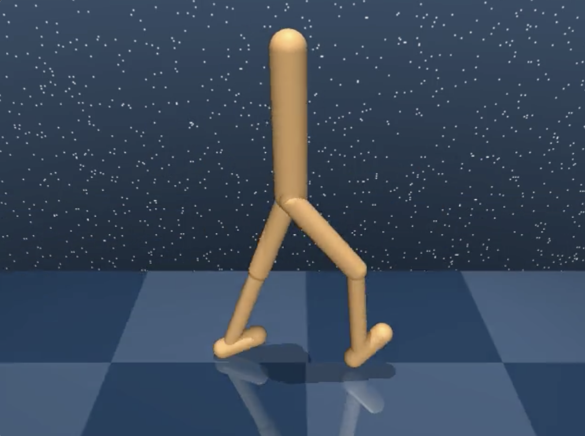

# MPPI on DM-Control

Sampling-based model-predictive control — **MPPI** and MJPC-style **Predictive
Sampling** — running on the *true* MuJoCo simulator via
[`dm_control`](https://github.com/google-deepmind/dm_control).

<p align="center">
  <br>
  
</p>

There is **no learning and no surrogate model**. The planner uses a copy of the
real simulator as its dynamics model and the *exact* task reward as its
objective, so at every control step it just samples action sequences, rolls them
through the real physics, and reward-weights them. The same body-agnostic planner
drives the DM-Control **walker** and the **Unitree Go2** robot — switching between
them is a single `--domain` flag.

Full recordings are in `media/go2_walk.mp4` (Go2) and `media/walker_mppi.mp4`
(walker).

## Install

```bash
python -m venv .venv && source .venv/bin/activate
pip install -r requirements.txt
# or, to get the `mppi-locomotion` console command:
pip install -e .
```

`dm_control`/`mujoco` need a working MuJoCo install. For offscreen rendering
(`--record`) set the GL backend: `MUJOCO_GL=glfw` on macOS, `MUJOCO_GL=egl`
(or `osmesa`) on a headless Linux machine:

```bash
MUJOCO_GL=glfw python run_mppi.py --domain go2 --task walk --record media/go2.mp4
```

The first `--domain go2` run downloads the Unitree Go2 model from `MuJoCo
Menagerie <https://github.com/google-deepmind/mujoco_menagerie>`_ (via
`robot_descriptions`) and caches it under `~/.cache/robot_descriptions`.

## Quick start

```bash
python run_mppi.py                       # walker walk, MPPI, no recording
python run_mppi.py --record media/walker.mp4
```

## Switching the body

This is the headline feature — pick the robot with `--domain`:

```bash
python run_mppi.py --domain walker --task walk --record media/walker.mp4
python run_mppi.py --domain go2    --task walk --record media/go2.mp4
```

Each body ships with sensible default tasks and MPPI hyperparameters, so you only
need the two flags above. Override anything you like:

```bash
python run_mppi.py --domain go2 --task run --samples 200
python run_mppi.py --domain walker --planner ps --task run   # predictive sampling
```

### How body-swapping works

All body-specific configuration lives in one place:
[`mppi/domains.py`](mppi/domains.py). Each body is a single `DomainConfig`
entry holding its tasks, render camera, and starting-point MPPI hyperparameters.
The planner itself ([`mppi/planner.py`](mppi/planner.py)) is body-agnostic — it
reads the action dimension, bounds, timesteps, and reward straight from the
environment.

Most bodies come straight from `dm_control.suite` (just set the `domain` name).
A body with no built-in suite task — like the Go2 — instead provides a `loader`
callable that builds its own environment (see [`mppi/go2.py`](mppi/go2.py)). To
add a new suite body, add one entry; nothing else needs to change:

```python
# mppi/domains.py
DOMAINS['cheetah'] = DomainConfig(
    'cheetah', tasks=('run',), camera_id=0, H=25, N=100, sigma=0.3,
)
```

| Body        | Source              | Tasks               | Default H / N / sigma |
|-------------|---------------------|---------------------|-----------------------|
| `walker`    | dm_control suite    | walk, stand, run    | 25 / 100 / 0.3        |
| `go2`       | Unitree (Menagerie) | walk, stand, run    | 16 / 150 / 0.3        |

`sigma` is in the body's action units — torque for the walker, joint-target
radians for the Go2 — so the defaults differ accordingly. Treat them as starting
points and tune. If a rendered view looks off, change `camera_id` in
`mppi/domains.py` or pass `--camera N`.

### The Unitree Go2

Unlike the suite bodies, the Go2 ships only as a raw MuJoCo model (no task, no
reward), so [`mppi/go2.py`](mppi/go2.py) supplies both:

- **Environment** — built from Menagerie's `scene.xml` (robot + ground + lights)
  with a COM-tracking chase camera so the robot stays in frame for long videos.
- **Reward** — a forward-walk objective: keep the base upright and at standing
  height, and move forward at the task's target speed *in a straight line* (it
  also penalizes sideways drift and yawing off the heading, so the robot doesn't
  crab sideways to game the forward-velocity term).
- **Control** — a real Go2 is commanded with joint *position* targets tracked by
  an onboard PD loop, which is also far more stable for sampling MPC than raw
  torque. So the model's torque motors are converted to PD position actuators
  (capped at the real torque limits), and the planner samples small joint-target
  offsets around the standing pose (the planner's `u_ref`, exposed as the task's
  `nominal_action`) instead of around an all-zero, collapsed configuration.

The Go2 runs the *true* simulator inside the planner, so it is heavier than the
suite bodies (~1 s per control step at the defaults); a recorded episode takes a
few minutes.

## How the planner works

At each control step the planner:

1. snapshots the real sim state `x0`,
2. samples `N` action sequences by perturbing a nominal mean with Gaussian noise
   (the nominal itself is always kept as one candidate, so the update can never
   do worse than the warm start),
3. rolls each candidate through a planning copy of the sim (`share_model=True`,
   so real episodes are never disturbed), summing the true (optionally
   discounted) reward over the horizon `H`,
4. updates the nominal:
   - `--planner mppi` — reward-weighted softmax average of the candidates,
   - `--planner ps` — MJPC Predictive Sampling, the single best candidate,
5. executes the nominal's first action and shifts the nominal forward to
   warm-start the next step.

## CLI reference

| Flag | Default | Description |
|------|---------|-------------|
| `--domain` | `walker` | Body to control (`walker`, `go2`). Sets the defaults below. |
| `--task` | domain's first task | Task within the domain. |
| `--planner` | `mppi` | `mppi` (softmax) or `ps` (predictive sampling). |
| `--seed` | `0` | RNG seed (planner uses `seed + 1`). |
| `--horizon` | per-domain | Planning horizon `H`. |
| `--samples` | per-domain | Rollouts per step `N`. |
| `--sigma` | per-domain | Action-noise std. |
| `--lam` | `0.1` | MPPI softmax temperature. |
| `--gamma` | `1.0` | Reward discount over the horizon. |
| `--max_steps` | `1000` | Cap on environment steps. |
| `--camera` | per-domain | Render camera id. |
| `--record` | none | Output mp4 path (omit to skip recording). |
| `--record_width` / `--record_height` / `--record_fps` | 640 / 480 / 30 | Video params. |

## Project layout

```
run_mppi.py          # CLI entry point
mppi/
  planner.py         # MPPIPlanner — body-agnostic sampling MPC
  domains.py         # DOMAINS registry — the place to add/switch bodies
  go2.py             # Unitree Go2 env + forward-walk reward (custom loader)
  runner.py          # run_episode — load task, drive it, record
  cli.py             # argparse, wires per-domain defaults into run_episode
media/              # demo clips + README/social images
  go2_walk.mp4
  walker_mppi.mp4
```
